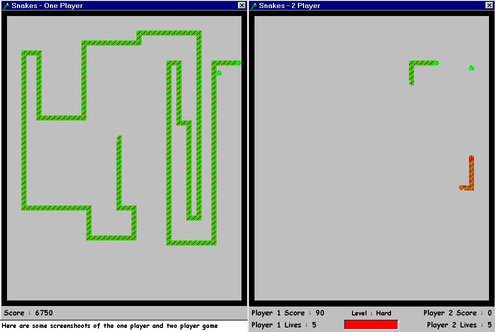



## \_A  Awesome Snakes Game

### Description

This is a good example of implementing linked-lists. This is a fun and addictive snakes game with lots of interesting and original features. You can play just a one player game where you just collect food and watch your tail grow.

Or you can play a two player game which is vey different and much more fun. This is where you compete with another snake for to eat the food and try and trap him with your tail so he dies. You can either play against the computer, with three levels of artifical intelligence, or player against a friend.

You can also select an option which allows you to go through the walls !

Please vote (what you think I should get) and give me as much feedback as possible. I would like to know what you think of it.
 
### More Info
 

             |
---                |---
**Submitted On**   |2001-07-28 13:41:16
**By**             |[Rosh Mendis](https://github.com/Planet-Source-Code/PSCIndex/blob/master/ByAuthor/rosh-mendis.md)
**Level**          |Intermediate
**User Rating**    |4.6 (60 globes from 13 users)
**Compatibility**  |VB 5\.0, VB 6\.0
**Category**       |[Games](https://github.com/Planet-Source-Code/PSCIndex/blob/master/ByCategory/games__1-38.md)
**World**          |[Visual Basic](https://github.com/Planet-Source-Code/PSCIndex/blob/master/ByWorld/visual-basic.md)
**Archive File**   |[A Awesome 236557282001\.zip](https://github.com/Planet-Source-Code/rosh-mendis-a-awesome-snakes-game__1-25592/archive/master.zip)

